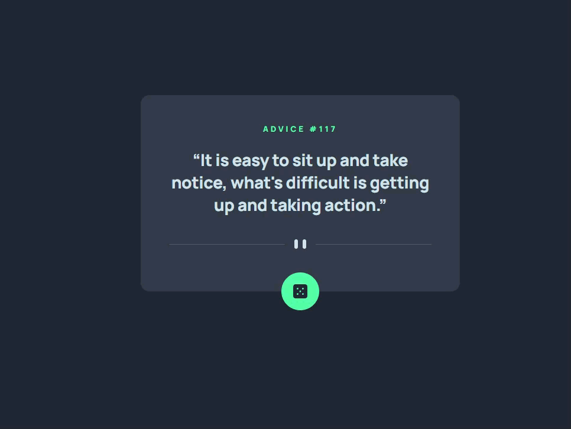

# Frontend Mentor - Advice generator app

This is a solution to the [Advice generator app challenge on Frontend Mentor](https://www.frontendmentor.io/challenges/advice-generator-app-QdUG-13db). Frontend Mentor challenges help you improve your coding skills by building realistic projects.

## Table of contents

- [Overview](#overview)
  - [The challenge](#the-challenge)
  - [Screenshot](#screenshot)
  - [Links](#links)
- [My process](#my-process)
  - [Built with](#built-with)
  - [What I learned](#what-i-learned)
  - [Continued development](#continued-development)
  - [Useful resources](#useful-resources)
- [Author](#author)

## Overview

### The challenge

Users should be able to:

- Click the dice button and get a random piece of advice

### Screenshot




### Links

- Solution URL: [https://www.frontendmentor.io/solutions/advice-generator-app-Sheqyjopr](https://www.frontendmentor.io/solutions/advice-generator-app-Sheqyjopr)
- Live Site URL: [https://shelb-doc.github.io/Advice_Gen/](https://shelb-doc.github.io/Advice_Gen/)

## My process

### Built with

- CSS custom properties
- CSS Grid
- Mobile-first workflow

### What I learned

How to use promises again.

```js
const renderAdvice = (adviceObj) => {
    const {id, advice} = adviceObj;
    adviceNumberSpan.textContent = `ADVICE #${id}`;
    adviceQuoteSlot.textContent = advice;
};
```

### Continued development

Do another one with a different api and see how it translates

## Author

- Website - [Shelby De Oliveira Cignetti](https://shelby-doc-portfolio.netlify.app/)
- Frontend Mentor - [@shelb-doc](https://www.frontendmentor.io/profile/shelb-doc)
- Twitter - [@reportturret](https://www.twitter.com/reportturret)